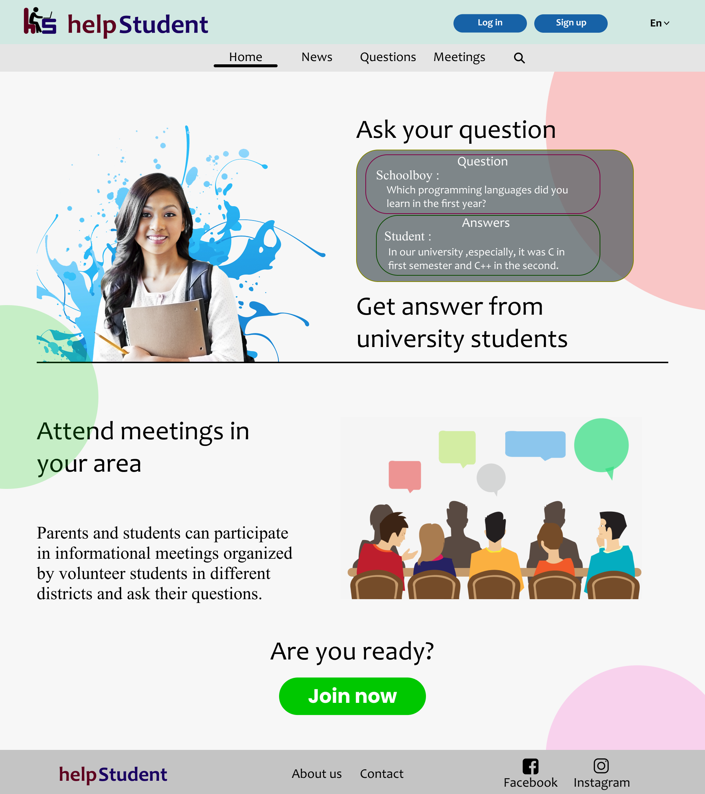
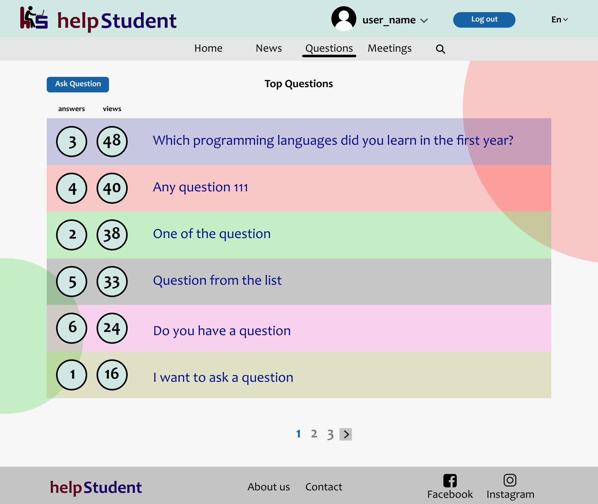
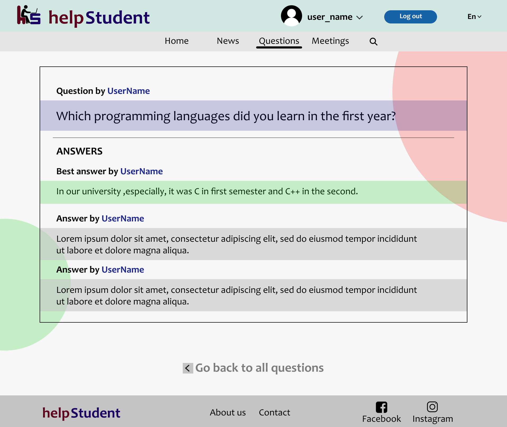
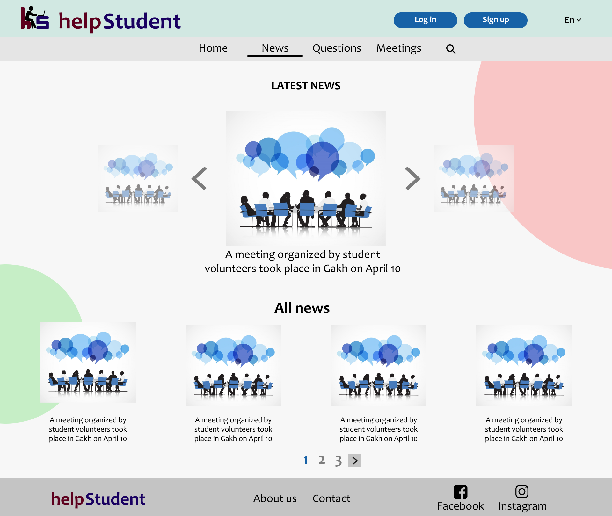
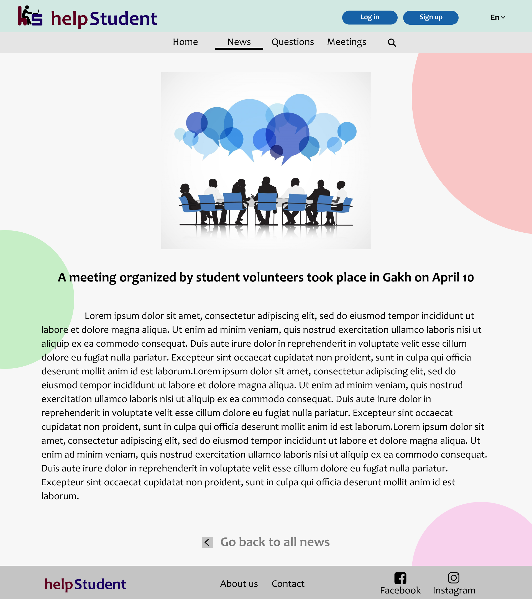
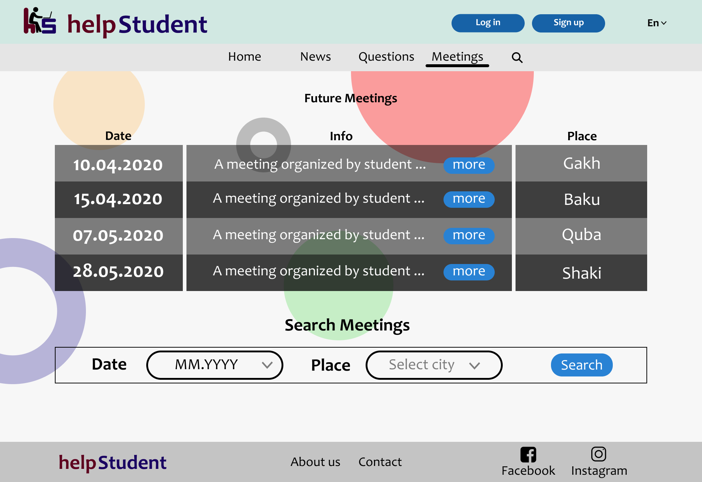
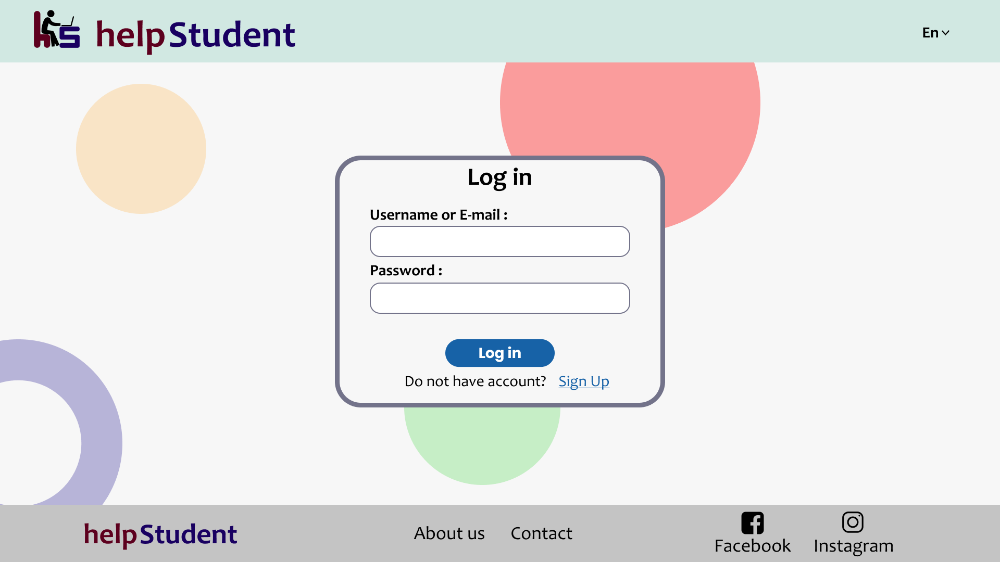

# project-help-student
N-Tier ASP.Net Core Web REST API Application

# THE PROJECT IS UNDER DEVELOPMENT

# Purpose of the Application
This website is for anyone - especially for school students - for getting information and help from
university students or teachers about departments and faculties taught in universities. Everyone
can ask a question and search for meetings organized by volunteer students.

## Project does not have FrontEnd part yet. Images below are created in Figma for University Assignment
### Home Page

### Questions Page

### Single Question Page

### News Page

### Single News Page

### Meetings Page

### Sign Up Page

### Login Page

